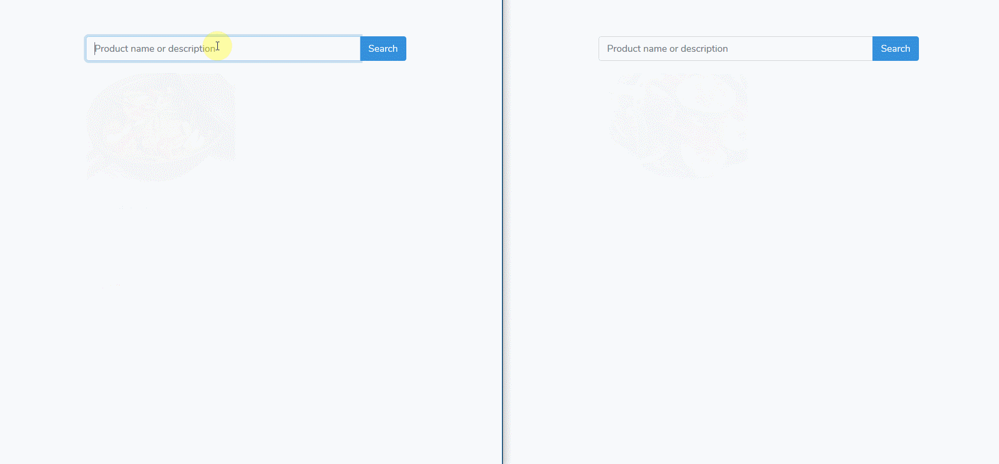

## Realtime search feature with Pusher.

A realtime search feature with Laravel using Pusher for realtime stuff 

## Getting Started
Make sure you have `npm` and `composer` on your local machine

1.  Clone this repository and cd into it
2.  Run `composer install` and `npm install` to download laravel dependencies
3.  Run `php artisan key:generate` to generate a key for the app
4.  Set up your [pusher account](https://dashboard.pusher.com/accounts/sign_up)
5.  Set up your database in your `.env` file and run php `php artisan migrate --seed`
6.  Execute `npm run dev` to build project assets
7.  Execute `php artisan serve` to run the project in your browser
8.  See the [tutorial](https://pusher.com/tutorials/search-laravel-vue) for useful notes 

### Prerequisites

* Laravel
* Vue
* Vuex
* npm
* Pusher account

## Built With

* [Pusher channels](https://pusher.com/channels) - Pusher Channels
* [Laravel](https://laravel.com/) - Beautiful Php framework
* [Vue](https://vuejs.org/) - A Great reactive Js framework
* [Vuex](https://vuejs.org/) - Vuejs state management made simple
* [Bootstrap](https://getbootstrap.com) - A beautiful Css framework
* [Axios](https://vuejs.org/) - A Js library to handle ajax requests easily

